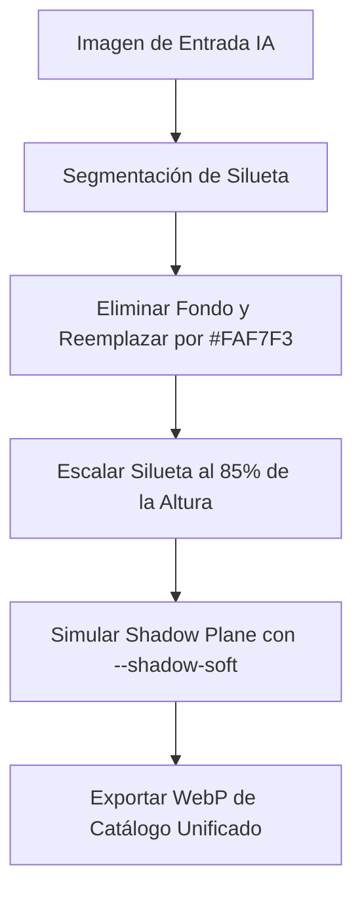

# KOALA VISUAL SYSTEM v1
## "LA BIBLIA VISUAL DE KOALA" — Sistema Operativo de Identidad & Diseño
*Diseño Editorial, Estructura Premium y Experiencia Operacional Unificada*

---

> [!NOTE]
> **DOCUMENTO MAESTRO DE INGENIERÍA Y DIRECCIÓN CREATIVA**
> Este sistema es la única fuente de verdad visual para la plataforma **KOALA by JC**. Toda interfaz, fotografía, animación, componente e integración de Inteligencia Artificial debe alinearse de forma estricta y matemática a las directrices aquí especificadas.

---

```
                       __  __  _____   ____   _         _____ 
                      |  |/  |/     \ /    \ | |    ___/ ___/ 
                      |  /  /|  / \  |  /\  || |   / __/\___ \ 
                      |     \|  \_/  |  \/  || |__/ /___ ___/ |
                      |__|\__|\_____/ \____/ |____\____/____/ 
                                BY JC — VISUAL SYSTEM v1
```

---

## 1. VISUAL IDENTITY SYSTEM (Sistema de Identidad Visual)

El ecosistema visual de **KOALA by JC** se define a través de una fusión única de cuatro pilares de referencia de la industria moderna:

$$\text{Identidad KOALA} = \text{Precisión Técnica (Nike)} + \text{Estructura Editorial (Zara)} + \text{Minimalismo Funcional (Apple)} + \text{Curaduría Selectiva (GOAT)}$$

### Principios Fundamentales del Ritmo Visual
1. **Limpio y Respirable:** El espacio negativo (aire) no es espacio vacío; es una herramienta de lujo para enfocar la atención del usuario. Cada elemento interactivo debe tener un margen de respiración generoso.
2. **Espacio Asimétrico Controlado:** Combinamos grids estrictamente simétricos para el catálogo con secciones de campaña asimétricas para generar dinamismo y ritmo editorial.
3. **Consistencia sin Monotonía:** Los componentes comparten la misma estructura molecular (tokens de diseño), pero el contenido de imagen aporta la textura y la emoción cromática.
4. **Tono Visual y Percepción Emocional:** El tono debe ser sofisticado, maduro, cercano al *streetwear premium* y al *bespoke fashion*. No se siente corporativo ni transaccional; se siente como una experiencia de curaduría de arte textil.

---

## 2. PRODUCT IMAGE SYSTEM (Sistema de Imagen de Producto)

Las imágenes de producto son el núcleo de la interfaz. No son simples ilustraciones de catálogo; son piezas editoriales con reglas físicas y proporciones matemáticas estrictas.

```
+---------------------------------------------------------+
|                  PRODUCT IMAGE SYSTEM                   |
|                                                         |
|   +-------------------------------------------------+   |
|   |                  SAFE ZONE                      |   |
|   |   +-----------------------------------------+   |   |
|   |   |                                         |   |   |
|   |   |            OPTICAL CENTER               |   |   |
|   |   |                  x                      |   |   |
|   |   |                                         |   |   |
|   |   +-----------------------------------------+   |   |
|   |                                                 |   |   |
|   |   <- - - - - Minimum 10% Padding - - - - - ->   |   |
|   +-------------------------------------------------+   |
|                                                         |
+---------------------------------------------------------+
```

### Reglas Específicas por Tipo de Imagen

| Tipo de Imagen | Objetivo UX | Reglas de Composición | Alineación y Padding |
| :--- | :--- | :--- | :--- |
| **Product Shot** (Catálogo) | Apreciación del producto | Silueta limpia, fondo plano neutro. Sin elementos distractores. | Centrado óptico. Padding de seguridad mínimo de **10%** en todos sus bordes. |
| **Hero Image** (Campañas) | Impacto y deseo | Composición artística, planos medios o detalles conceptuales. | Desplazado sutilmente a la izquierda o derecha para acomodar tipografía limpia. |
| **Lifestyle Image** | Contextualización | Entornos urbanos premium, luz natural, tonos de color armonizados. | Integración orgánica con el grid. Proporción 4:5 vertical dominando la pantalla. |
| **Detail Shot** (Detalles) | Percepción de calidad | Macrofotografía enfocada en costuras, texturas, zippers o herrajes. | Close-up extremo. Profundidad de campo muy baja (bokeh suave). |
| **Editorial Banner** | Comunicación y Drop | Bloques tipográficos combinados con fotografía asimétrica. | Estilo de revista de moda. La imagen no debe pisar la legibilidad tipográfica. |

---

## 3. BACKGROUND SYSTEM (Sistema de Fondos)

El sistema de fondos utiliza una paleta cromática sofisticada para dar sensación de calidez y valor premium. Evitamos los fondos blancos clínicos de laboratorio en favor de matices de color orgánicos.

### La Paleta de Lujo (Neutral & Luxury Palette)

*   **Fondo Primario:** `#FAF7F3` (*Warm Alabaster* / Alabastro Cálido)
    *   *Uso:* Canvas principal para toda la aplicación. Aporta calidez y reduce la fatiga visual.
*   **Fondo Secundario:** `#F5EFE8` (*Warm Canvas* / Canvas de Tierra)
    *   *Uso:* Fondos de barras laterales (sidebars), pies de página (footers), áreas de inputs y bloques de separación.
*   **Fondo Elevado:** `#FFFFFF` (*Pure Light* / Luz Pura)
    *   *Uso:* Tarjetas activas (cards), modales y dropdowns flotantes. Crea una ilusión tridimensional de elevación natural.
*   **Fondo Oscuro de Contraste:** `#1E1712` (*Obsidian Soil* / Suelo de Obsidiana)
    *   *Uso:* Secciones de impacto dramático, headers de lujo, menús oscuros y banners promocionales.

### Filosofía de Contraste y Elevación
Toda interfaz KOALA se rige por capas físicas superpuestas:

$$\text{Capa base (Warm Alabaster)} \rightarrow \text{Capa de agrupación (Warm Canvas)} \rightarrow \text{Elemento interactivo (Pure Light + Soft Shadow)}$$

---

## 4. LIGHTING SYSTEM (Sistema de Iluminación de Imagen)

Para que el catálogo mantenga una homogeneidad premium, todas las imágenes deben seguir la regla maestra de iluminación física del estudio de KOALA.

### Regla Principal: *Luxury Soft Studio Lighting*

```
     [ LUZ DE ESTUDIO DIFUSA (45°) ]
               \
                \  . - - - .
                 (   Objeto  )
                / ' - - - '
               /
     [ REFLECTOR CÁLIDO DE RELLENO ]
     
     RESULTADO: Sombra difusa y degradado suave hacia abajo a la derecha
```

*   **Dirección de la Luz:** Luz principal proveniente de la parte superior izquierda a 45 grados de inclinación.
*   **Suavidad de la Iluminación:** Uso obligatorio de difusores (softboxes) de gran formato para eliminar sombras duras en el producto.
*   **Shadow Roll-off:** La transición hacia la sombra debe ser un degradado sumamente sutil. Las sombras deben ser ligeras, nunca negras sólidas.
*   **Balance de Temperatura:** Temperatura cálida-neutra equilibrada a **5200K - 5500K**, logrando que los tonos de piel y los textiles se sientan realistas y acogedores.

---

## 5. CROPPING SYSTEM (Sistema de Recorte y Relaciones de Aspecto)

La consistencia matemática del catálogo depende del cropping uniforme. Un recorte inconsistente rompe el ritmo visual y disminuye la percepción de calidad.

### Especificación de Relaciones de Aspecto (Ratios)

1.  **Catálogo y Fichas de Producto:** **Proporción 4:5** (Vertical)
    *   *Dimensiones base:* $1200 \times 1500\text{ px}$.
    *   *Justificación:* Es la proporción que mejor optimiza las pantallas móviles, otorgando mayor área visual de textil e indumentaria.
2.  **Banners de Campaña (Desktop):** **Proporción 16:9**
    *   *Dimensiones base:* $1920 \times 1080\text{ px}$.
3.  **Vistas Previas y Miniaturas:** **Proporción 1:1** (Cuadrada)
    *   *Dimensiones base:* $600 \times 600\text{ px}$.

### Regla de Centrado de Silueta
El producto debe centrarse ópticamente utilizando su centro de masa visual, no la caja delimitadora matemática (bounding box). El espacio libre superior e inferior de la silueta del calzado o indumentaria debe ser exactamente del **10%** del alto de la imagen.

---

## 6. THUMBNAIL SYSTEM (Sistema de Miniaturas)

Las miniaturas son la tarjeta de presentación en los flujos rápidos (carrito, búsquedas rápidas, selección de variantes).

*   **Geometría:** Rectángulos de proporción vertical 4:5 con bordes redondeados controlados (`border-radius: var(--radius-md)` / $10\text{ px}$).
*   **Bordes y Líneas de Tensión:** Un sutil borde perimetral de un pixel (`border: 1px solid var(--color-neutral-border)`) para delimitar el canvas de la miniatura frente al fondo.
*   **Variantes en Carrito:** Tamaño estricto de $80 \times 100\text{ px}$ en móviles y $96 \times 120\text{ px}$ en escritorio.
*   **Efecto Hover de Miniatura:** Opacidad del fondo cambia suavemente mediante una transición de color de `var(--color-bg-surface)` a `var(--color-neutral-lighter)`.

---

## 7. SPACING SYSTEM (Sistema de Espaciado)

Espaciar de forma inteligente es el secreto de la interfaz de lujo. Nos basamos en una escala de espaciado estricta de base 4px.

### La Escala de Espaciado Oficial

| Token CSS | Equivalente | Uso en Interfaz |
| :--- | :--- | :--- |
| `--space-1` | `0.25rem` (4px) | Espaciado micro (línea de marca, tags pequeños). |
| `--space-2` | `0.5rem` (8px) | Espaciado interno de etiquetas y botones pequeños. |
| `--space-3` | `0.75rem` (12px) | Separación entre textos y elementos de interfaz de soporte. |
| `--space-4` | `1rem` (16px) | Padding interno de cards de producto, inputs y botones principales. |
| `--space-6` | `1.5rem` (24px) | Separación entre tarjetas de producto dentro del grid de catálogo. |
| `--space-8` | `2rem` (32px) | Padding de contenedores primarios y márgenes laterales de página. |
| `--space-12` | `3rem` (48px) | Separación estándar entre secciones de contenido principales. |
| `--space-16` | `4rem` (64px) | Espacio de respiración de grandes bloques (Hero sections, Footers). |

### Reglas de Respiración ("Breathing Space Rules")
Ninguna caja de texto con descripción debe quedar a menos de $24\text{ px}$ (`--space-6`) de la imagen del producto. Los grids de productos nunca deben colapsar; en móviles, el espacio libre perimetral de la pantalla debe ser exactamente de $16\text{ px}$ (`--space-4`).

---

## 8. SHADOW SYSTEM (Sistema de Sombras de Interfaz)

Evitamos las sombras planas, negras y pesadas de corte tecnológico de los años 2010. Adoptamos la filosofía de capas físicas difusas de Apple UI y revistas digitales modernas.

### Estructura de Capas de Sombras en CSS

```css
/* Sombras ultra suaves optimizadas con el color primario de KOALA */
:root {
  --shadow-xs: 0 1px 2px rgba(42, 33, 27, 0.04);
  --shadow-soft: 0 4px 12px rgba(42, 33, 27, 0.03);
  --shadow-md: 0 8px 24px rgba(42, 33, 27, 0.06);
  --shadow-elevated: 0 16px 40px rgba(42, 33, 27, 0.09);
  --shadow-card-hover: 0 12px 28px rgba(42, 33, 27, 0.08);
}
```

*   **Tono de Sombra:** La sombra utiliza como base cromática un marrón oscuro terroso (`rgba(42, 33, 27, ...)`) derivado del color principal de KOALA (`#2B221C`), logrando que la sombra se integre de forma natural sobre el fondo cálido neutral.
*   **Difusión:** Los radios de desenfoque (*blur*) son al menos el doble de la distancia de desplazamiento horizontal/vertical, asegurando un efecto difuminado realista.

---

## 9. TYPOGRAPHY HIERARCHY (Jerarquía Tipográfica)

La tipografía debe sentirse editorial y clara. Empleamos un emparejamiento clásico que combina la tradición tipográfica con la legibilidad técnica.

### Emparejamiento Tipográfico

1.  **Tipografía Display / Títulos:** `'Playfair Display', Georgia, serif`
    *   *Vibe:* Elegante, clásica, sofisticada.
    *   *Uso:* Nombres de colecciones, títulos principales de campañas, números de secciones y grandes titulares.
2.  **Tipografía Body / Interfaz:** `'Inter', system-ui, -apple-system, sans-serif`
    *   *Vibe:* Limpia, ultra-legible, técnica, moderna.
    *   *Uso:* Nombres de productos, precios, botones, tablas administrativas, textos de descripción y flujos interactivos.

### Escala y Pesos Tipográficos

```
[ TITULAR DE CAMPAÑA ] -> Playfair Display, Bold, 36px/44px, Tracking: -0.01em
[ Nombre de Producto ] -> Inter, Semibold, 16px/24px, Tracking: 0
[ Precio de Producto ] -> Inter, Medium, 14px/20px, Tracking: 0.02em
[ SUBTEXTO / DESCRIP ] -> Inter, Regular, 12px/18px, Tracking: 0
```

*   **Títulos de Banner (Hero):** `36px` (`--text-4xl`) - `Playfair Display`, Bold. Altura de línea: `1.2`.
*   **Títulos de Tarjeta:** `14px` (`--text-base`) - `Inter`, Semibold. Altura de línea: `1.4`.
*   **Precios:** `14px` (`--text-base`) - `Inter`, Medium. Color destacado: `var(--color-accent)`.
*   **CTAs y Botones:** `12px` (`--text-sm`) - `Inter`, Semibold. Transformación: `uppercase`. Espaciado de letras (*tracking*): `0.05em`.

---

## 10. CARD SYSTEM (Sistema de Tarjetas de Producto)

La tarjeta de producto (Product Card) es el componente central de interacción visual de KOALA.

```
+-----------------------------------+
|  PRODUCT CARD — ARCHITECTURE      |
|                                   |
|   +---------------------------+   |
|   |                           |   |
|   |                           |   |
|   |      IMAGE 4:5 CONTAINER  |   |
|   |                           |   |
|   |                           |   |
|   +---------------------------+   |
|                                   |
|   TAG DE MARCA (10px, Muted)      |
|   NOMBRE DEL PRODUCTO (14px)      |
|   PRECIO ($120.00, Accent)        |
|                                   |
|   +---+ +---+ +---+               |
|   |   | |   | |   | COLOR PICKER  |
|   +---+ +---+ +---+               |
+-----------------------------------+
```

### Arquitectura de una Tarjeta de Producto
*   **Relación de Aspecto de Imagen:** Estricto 4:5. El contenedor tiene un ligero *overflow hidden* para acomodar el borde redondeado de $10\text{ px}$.
*   **Comportamiento Hover:**
    1.  Desplazamiento vertical leve: `transform: translateY(-4px)`
    2.  Transición de sombra: de `var(--shadow-card)` a `var(--shadow-card-hover)`
    3.  Aparición sutil de acciones rápidas (ej. botón "Añadir Rápido" en un *fade-in* suave).
*   **Densidad Visual:** Los elementos de metadatos (título, precio, variante de colores) se sitúan debajo de la imagen con un espaciado limpio de $12\text{ px}$ (`--space-3`). El texto no debe competir visualmente con la imagen.

---

## 11. MOBILE VISUAL SYSTEM (Sistema Visual Móvil)

Diseño enfocado estrictamente en la experiencia táctil, reduciendo la fricción operacional en dispositivos móviles.

*   **Thumb Reach Optimization:** Toda acción principal (como seleccionar talle, color o presionar "Agregar Pedido") debe estar ubicada en el tercio inferior de la pantalla o mediante un botón de acción flotante / pegajoso (*sticky bottom action drawer*).
*   **Navegación Táctil:** Uso de galerías de imágenes deslizables horizontalmente (*swipeable product galleries*) con indicadores de paginación sutiles en lugar de miniaturas de control complejas.
*   **Catálogo Adaptativo:** Rejilla móvil configurada a **2 columnas** de forma estricta. El espaciado interior del grid es de exactamente $12\text{ px}$ (`--space-3`) para optimizar el espacio horizontal disponible sin saturar la pantalla.
*   **Gestos Suaves:** Los carruses e interfaces de scroll deben usar `scroll-snap-type: x mandatory` y `-webkit-overflow-scrolling: touch` para una respuesta de hardware inmediata.

---

## 12. IMAGE OPTIMIZATION SYSTEM (Optimización de Carga e Imágenes)

La belleza estética no sirve si la página tarda más de dos segundos en cargar. La rapidez operativa es el verdadero lujo digital.

### Reglas Técnicas de Performance-First

1.  **Formatos Oficiales:**
    *   **Formato de Compresión Primario:** **WebP**
    *   *Calidad de Compresión:* **82%** (el punto dulce que balancea compresión de bytes sin introducir artefactos visuales de chroma).
    *   **Formato Alternativo (Fotografía Editorial):** **AVIF** para banners de landing page pesados.
2.  **Estrategia Retina (Responsive Images):**
    *   Uso mandatorio de la etiqueta `<picture>` o el atributo `srcset` en HTML para entregar:
        *   **1x:** Pantallas estándar ($800\text{ px}$ de ancho máximo para catálogo).
        *   **2x:** Pantallas Retina y de alta densidad ($1600\text{ px}$ de ancho máximo).
3.  **Lazy Loading Sistemático:**
    *   Toda imagen que no aparezca en el primer tercio visible de la pantalla (above-the-fold) debe incluir obligatoriamente el atributo `loading="lazy"`.
    *   Para las imágenes críticas de la parte superior, se utilizará `<link rel="preload">` para acelerar el despliegue cromático del producto.

---

## 13. AI IMAGE NORMALIZATION SYSTEM (Sistema de Normalización por IA)

Diseño de reglas operativas para los futuros motores de automatización de imágenes mediante Inteligencia Artificial (IA) en KOALA.



### Protocolo de Normalización Automatizada
1.  **Detección de Producto y Segmentación:** El sistema de visión por computadora debe segmentar el objeto (calzado, camisa, gorro) y aislarlo de fondos fotográficos inconsistentes.
2.  **Reemplazo de Fondo:** El fondo resultante debe ser reemplazado de manera exacta por el color sólido neutro `#FAF7F3`.
3.  **Ajuste de Altura y Bounding Box:** El algoritmo debe redimensionar la silueta para que ocupe exactamente el **85%** de la altura total del canvas del contenedor 4:5, manteniendo su proporción original.
4.  **Generación de Sombra Física Sintética:** Se aplicará un degradado simulado de sombra de contacto en la base del producto, con orientación vertical del $2\%$ hacia abajo e inclinación del $1\%$ hacia la derecha, armonizando con el *Lighting System* de KOALA.

---

## 14. CATALOG CONSISTENCY SYSTEM (Consistencia del Catálogo Global)

El catálogo debe verse homogéneo de principio a fin, sin importar la naturaleza diversa de las colecciones (unidades de calzado, indumentaria, o herrajes de accesorios).

### Parámetros de Uniformidad en Catálogo

*   **Horizonte de Suelo Unificado:** El plano de suelo imaginario donde descansan los productos debe fijarse al **75%** de la altura vertical en todas las tarjetas del catálogo.
*   **Rotación y Ángulo Estándar:**
    *   *Calzado (Sneakers):* Ángulo perfil de tres cuartos con la punta orientada hacia la izquierda en $15^\circ$.
    *   *Prendas Superiores (Hoodies, T-Shirts):* Colgado en maniquí invisible plano o tendido simétrico de corte minimalista.
    *   *Accesorios:* Toma cenital (desde arriba) o de tres cuartos sobre bloques geométricos cálidos.

---

## 15. PERFORMANCE + LUXURY BALANCE (Equilibrio de Rendimiento de Lujo)

El lujo es velocidad. La lentitud en una animación destruye la percepción premium.

*   **Pautas de Rendimiento de Animación:**
    *   Queda estrictamente prohibido animar propiedades que provoquen reflows o repaints del navegador (por ejemplo: `width`, `height`, `margin`, `top`, `left`).
    *   Las transiciones e interacciones deben realizarse de forma exclusiva mediante **Hardware Acceleration** utilizando propiedades optimizadas: `transform` (para traslaciones, rotaciones y escalas) y `opacity`.
*   **Esqueletos de Carga de Alta Fidelidad (Skeleton Loader System):**
    *   Durante el estado de carga (`Loading State`), las tarjetas del catálogo deben renderizar una silueta degradada suave que replique de forma milimétrica la proporción 4:5 y la paleta de fondos cálidos de KOALA, evitando parpadeos visuales disruptivos.

---

## 16. APÉNDICE TÉCNICO: DECLARACIÓN E INTEGRACIÓN EN CSS

Para facilitar la adopción automática por parte de futuros desarrolladores y sistemas de IA, a continuación se muestra la integración semántica de este sistema visual con las clases CSS globales del proyecto:

```css
/* ==========================================================================
   KOALA PREMIUM UTILITIES - COMPATIBLE CON KOALA VISUAL SYSTEM v1
   ========================================================================== */

/* Contenedor de Imagen de Catálogo Proporción 4:5 */
.koala-image-container {
  position: relative;
  width: 100%;
  aspect-ratio: 4 / 5;
  overflow: hidden;
  border-radius: var(--radius-md);
  background-color: var(--color-bg-surface);
  border: 1px solid var(--color-neutral-border);
}

.koala-product-img {
  width: 100%;
  height: 100%;
  object-fit: cover;
  object-position: center;
  transition: transform var(--duration-normal) var(--ease-smooth);
}

/* Efecto Premium de Tarjeta de Producto */
.koala-product-card {
  display: flex;
  flex-direction: column;
  background-color: var(--color-bg-elevated);
  border-radius: var(--radius-lg);
  padding: var(--space-4);
  box-shadow: var(--shadow-card);
  transition: transform var(--duration-normal) var(--ease-smooth),
              box-shadow var(--duration-normal) var(--ease-smooth);
  cursor: pointer;
}

.koala-product-card:hover {
  transform: translateY(-4px);
  box-shadow: var(--shadow-card-hover);
}

.koala-product-card:hover .koala-product-img {
  transform: scale(1.03);
}

/* Tipografía de Lujo Editorial */
.koala-display-title {
  font-family: var(--font-display);
  font-weight: var(--weight-bold);
  line-height: var(--leading-tight);
  color: var(--color-text-primary);
  letter-spacing: var(--tracking-tight);
}

.koala-body-text {
  font-family: var(--font-body);
  font-weight: var(--weight-regular);
  line-height: var(--leading-normal);
  color: var(--color-text-secondary);
}
```

---

> *"No construimos una aplicación tradicional; diseñamos una experiencia de moda digital integrada, veloz y aspiracional."* — **KOALA Team**
